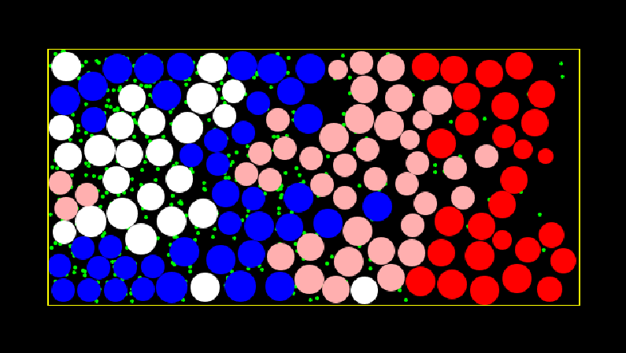

# Final Exercise Biomolecular Programming: "differentiation of tissues during development"

Welcome to the repository for my submission for the BMP 2020 final,

## A couple useful pieces of information:

- The main program is called "Exercise3_final.java" and can be found in BMP_Exercise3_final/NanoProg/nanocourse/Exercise3_final.java or by clicking the [on this link!](/NanoProg/nanocourse/Exercise3_final.java)

## Background reading, from the original assignment:

> During development of tissues, stem cells continuously divide after which one of the two daughter cells remains a stem cell while the other differentiates into a specific cell type dependent on which stem cell it comes from. One of the ways cells can differentiate according to their position is by so called morphogens. Morphogens are signaling molecules that act directly on cells but the response of the cells depends on the local concentration of the morphogen. The different responses lead to differences in the differentiation of the cell. 

> In some tissues, stem cells continuously release morphogen into the environment. Due to diffusion of the morphogens this creates a gradient of the morphogen concentration. The pluripotent stem cells present in this gradient can then differentiate into specialized cells based on their location in this gradient. The location of the morphogen producing cells as well as the local morphogen concentration (which depends on morphogen diffusion speed and lifetime) are crucial to the outcome of development.

> One of the earlier models that was developed is the so called French Flag model (fig 1) where cells produce morphogen and responding cells differentiate according to the concentration gradient. In figure 1B we see an example of an imaginary wing disc of a Drosophila embryo, with different stainings for different cells that will eventually form the wing of the fly. Many morphogens are involved in at this early stage already determining the anterior, posterior, dorsal and ventral side of the wing, and laying the basis for the form of the wing.

That's all for now,

TWH
